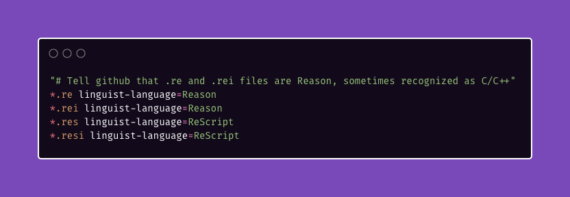

[](https://www.npmjs.com/package/resgitignore)

# [resgitignore](https://git.io/resgitignore)

Generates or appends [ReasonML](https://git.io/reasonml) and [Rescript](https://rescript-lang.org/) `.gitattributes`.

```sh
npx resgitignore
# or
npx idkjs/resgitignore
```

Gets you:

```sh
"# Tell github that .re and .rei files are Reason, sometimes recognized as C/C++"
*.re linguist-language=Reason 
*.rei linguist-language=Reason
*.res linguist-language=ReScript
*.resi linguist-language=ReScript
```




See also [bsconfig.json](https://git.io/bsconfig.json)

[mlxre](https://github.com/idkjs/mlxre)

[bsconfig.json](https://github.com/idkjs/bsconfig.json)

Inspired by [benawad/tsconfig.json](https://github.com/benawad/tsconfig.json)

[Share on Twitter...](https://twitter.com/share?text=Quickly+add+reasonml+and+rescript+attributes+to+your+project+https://github.com/idkjs/resgitignore)

